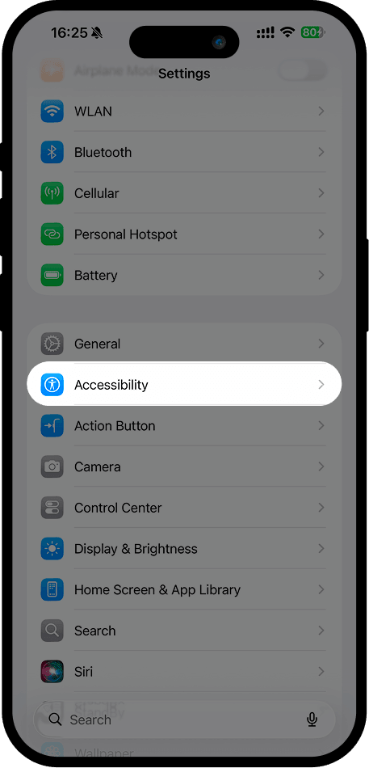
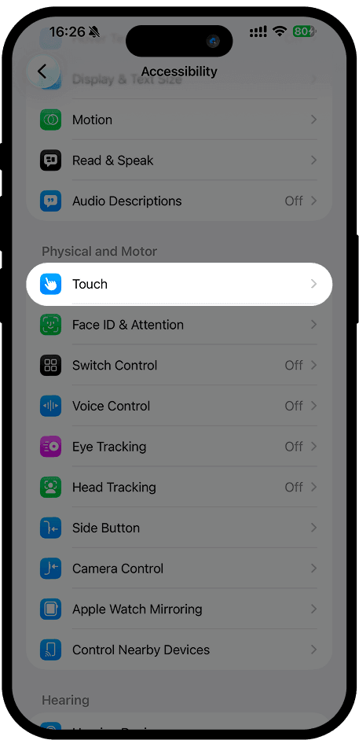
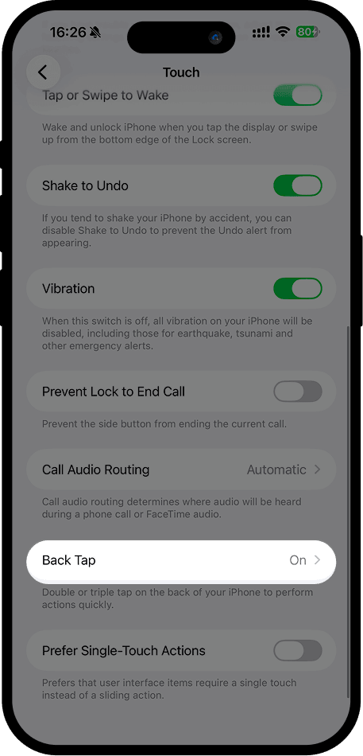
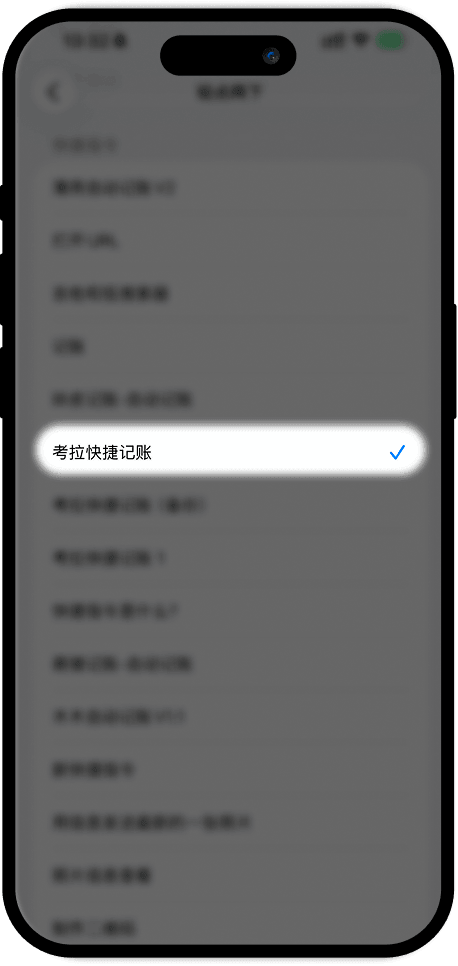

# Back Tap Guide

## 1. Open "Settings", select "Accessibility"

## 2. In "Accessibility", find "Touch" and tap it

## 3. In "Touch", find "Back Tap", tap to enter, then select "Double Tap" or "Triple Tap"

## 4. In "Double Tap" or "Triple Tap", scroll to the bottom and select "考拉快捷记账" under Shortcuts

