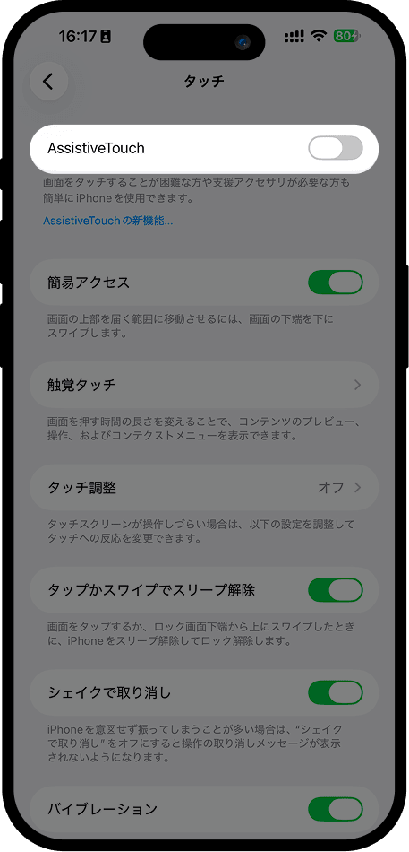

# AssistiveTouchガイド

## 1. 「設定」を開き、「アクセシビリティ」を選択

## 2. 「アクセシビリティ」画面で「タッチ」を見つけてタップ

## 3. 「タッチ」画面で「AssistiveTouch」を見つけてオンにする

## 4. 同じ「AssistiveTouch」画面で「アクションをカスタマイズ」→「シングルタップ」を選択し、下部にあるショートカットから「考拉快捷记账」を見つけて選択

