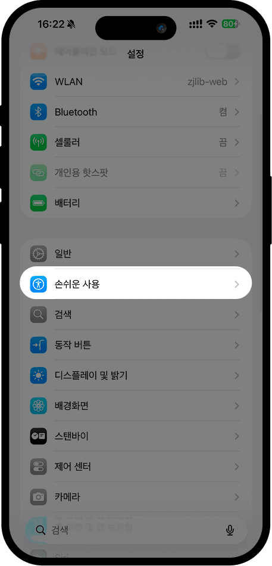
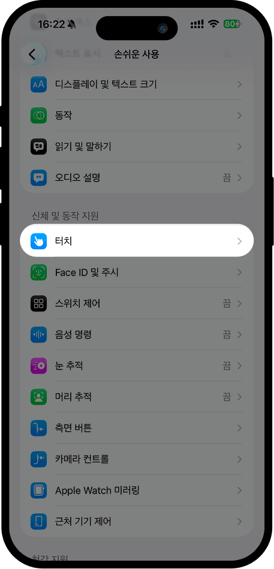
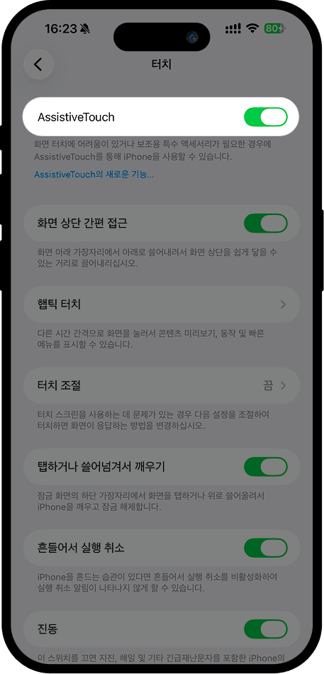

# AssistiveTouch 가이드

## 1. 「설정」을 열고 「손쉬운 사용」을 선택

## 2. 「손쉬운 사용」 화면에서 「터치」를 찾아 탭

## 3. 「터치」 화면에서 「AssistiveTouch」를 찾아 켜기

## 4. 동일한 「AssistiveTouch」 화면에서 「동작 사용자화」→「한 번 탭」을 선택한 후, 하단의 단축어 목록 중 「考拉快捷记账」을 찾아 선택

